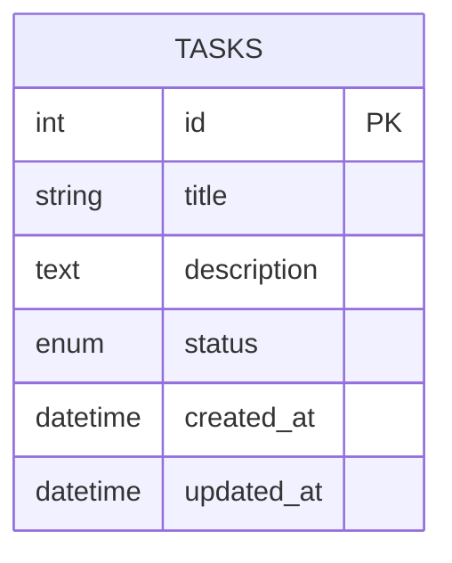
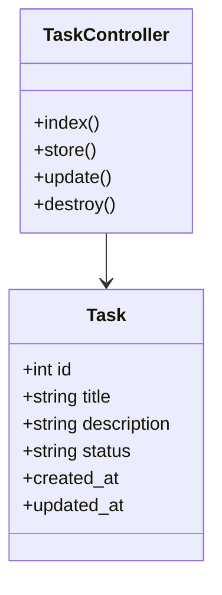
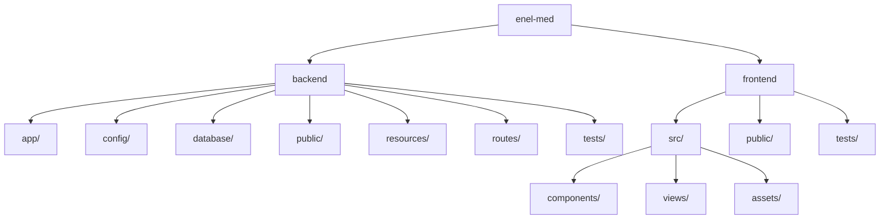
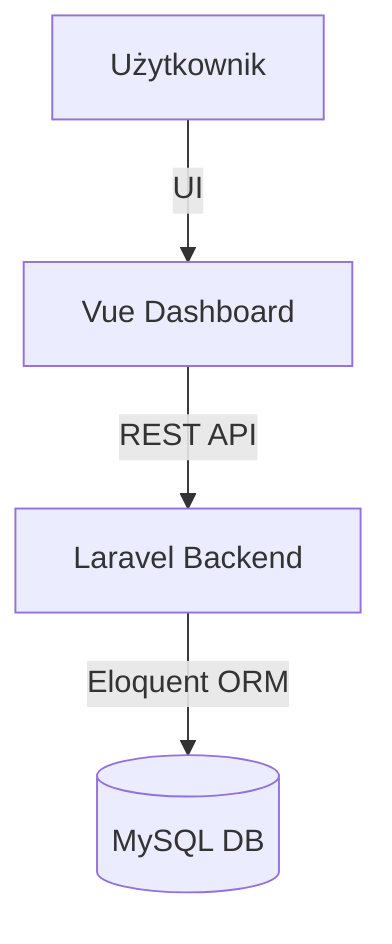

# To-Do Dashboard (Vue 3 + Laravel + Docker)

## Opis projektu

Aplikacja do zarządzania zadaniami (To-Do List) z możliwością dodawania, edytowania, usuwania oraz oznaczania zadań jako ukończone. Projekt składa się z backendu w PHP (Laravel) oraz frontendowej aplikacji w Vue.js z Tailwind CSS. Całość uruchamiana przez Docker Compose.

---

## Szybki start (Docker)

1. **Sklonuj repozytorium i przejdź do katalogu projektu**
2. **Uruchom całość przez Docker Compose:**
   ```sh
   docker-compose up -d --build
   ```
3. **Backend (Laravel API):**
   - Dostępny pod: [http://localhost:8000/api/tasks](http://localhost:8000/api/tasks)
4. **Frontend (Vue Dashboard):**
   - Dostępny pod: [http://localhost:5173](http://localhost:5173)
5. **Pierwsze uruchomienie:**
   - Wykonaj migracje:
     ```sh
     docker-compose exec backend php artisan migrate
     ```
   - Wygeneruj klucz aplikacji (wymagane przy pierwszym uruchomieniu lub po zmianie .env):
     ```sh
     docker-compose exec backend php artisan key:generate
     ```
     Klucz zostanie automatycznie zapisany w pliku `.env`.

---

## Funkcjonalności
- Dodawanie, edycja, usuwanie zadań
- Oznaczanie zadania jako ukończone
- Estetyczny dashboard (Vue 3 + Tailwind CSS)
- Obsługa błędów w UI (alerty)
- Animacje przy dodawaniu/usuwaniu
- Testy jednostkowe backend (PHPUnit) i frontend (Jest)

---

## Schemat bazy danych



---

## Diagram klas (UML)



---

## Struktura katalogów (UML)



---

## Architektura rozwiązania



---

## Testy

### Backend (PHPUnit)
```sh
docker-compose exec backend php artisan test
```

### Frontend (Jest)
```sh
docker-compose exec frontend npm run test
```

---

## Technologie
- Laravel 12+ (PHP)
- Vue 3 + Vite
- Tailwind CSS
- MySQL (Docker)
- Docker Compose
- PHPUnit, Jest

---

## Autor
Grzegorz Skotniczny